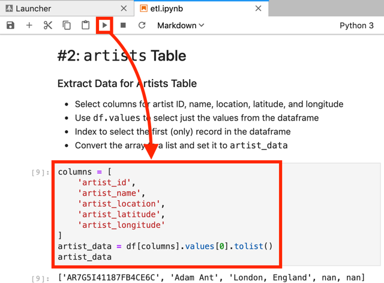

# Project: Data Modeling with Postgres<a name="home"></a>

A startup called Sparkify wants to analyze the data they've been collecting on songs and user activity on their new music streaming app. The analytics team is particularly interested in understanding what songs users are listening to. Currently, they don't have an easy way to query their data, which resides in a directory of JSON logs on user activity on the app, as well as a directory with JSON metadata on the songs in their app.

They'd like a data engineer to create a Postgres database with tables designed to optimize queries on song play analysis, and bring you on the project. Your role is to create a database schema and ETL pipeline for this analysis. You'll be able to test your database and ETL pipeline by running queries given to you by the analytics team from Sparkify and compare your results with their expected results.

## Table of contents

- [Structure](#structure)
- [Requirements](#requirements)
- [How to use](#how-to-use)
  - [Cloning the repository](#cloning-the-repository)
  - [Creating the virtual environment](#creating-the-virtual-environment)
  - [Running PostgreSQL](#running-postgresql)
  - [Notebooks](#notebooks)
  - [ETL](#etl-pipeline)
- [To-Do list](#to-do-list)

## Structure<a name="structure"></a>

This tree shows the repository structure. Only the project main files are described.

```
.
├── images
├── src
│   ├── data
│   │   ├── log_data       # Log files sample
│   │   └── song_data      # Song files sample
│   ├── create_tables.py   # Database initialization script
│   ├── env.py             # Environment variables
│   ├── etl.ipynb          # Lab notebook to test the ETL pipeline
│   ├── etl.py             # ETL pipeline script
│   ├── sql_queries.py     # Database queries
│   └── test.ipynb         # Lab notebook to verify the database insertions
├── .editorconfig
├── .gitignore
├── README.md
└── requirements.txt
```

## Requirements<a name="requirements"></a>

It is assumed that the tools below are properly installed locally:

- [Python](https://www.python.org/) is a programming language that lets you work quickly and integrate systems more effectively.
- [pip](https://pip.pypa.io/en/stable/) is the package installer for Python.
- [Virtualenv](https://virtualenv.pypa.io/en/latest/) is a tool to create isolated Python environments.
- [Docker Engine / Desktop](https://hub.docker.com/search/?type=edition&offering=community) powers millions of applications worldwide, providing a standardized packaging format for diverse applications.

## How to use<a name="how-to-use"></a>

### Cloning the repository<a name="cloning-the-repository"></a>

The first step is to clone this repository. Just type the following command in your Terminal:

```bash
# Clone the repository...
git clone https://github.com/vermicida/data-modeling-postgres.git

# ...and move to its directory
cd data-modeling-postgres
```

### Creating the virtual environment<a name="creating-the-virtual-environment"></a>

Once the project is cloned, you must create a new virtual environment for it. You may have multiple Python versions installed, so it's important to specify the correct one with the `--python` argument. The code on this repository has been successfully tested over Python 3.6, but it must work on any Python 3 version; set the version that applies to your case in the following commands:

```bash
# Create the virtual environment...
virtualenv --python python3.6 project-env

# ...and activate it
source project-env/bin/activate
```

It's time to install the project dependencies. You will use `pip` to do this job:

```bash
pip install -r requirements.txt
```

It may take awhile, be patient.

### Running PostgreSQL<a name="running-postgresql"></a>

You can lean on Docker to run PostgreSQL instead of install it. The available versions are described in the [postgres site](https://hub.docker.com/_/postgres) on Docker Hub: the latest stable version is `11.4` to this day (july 2019).

These are the arguments you must pass to `docker run` command in order to run the `postgres` container:

- `-e POSTGRES_USER='student'` is an environment variable to set the PostgreSQL user.
- `-e POSTGRES_PASSWORD='student'` is an environment variable to set the PostgreSQL password.
- `-e POSTGRES_DB='studentdb'` is an environment variable to set the PostgreSQL database.
- `-v $(pwd)/db:/var/lib/postgresql/data` sets a volume to persist the data.
- `-p 5432:5432` exposes the port 5432 to enable connections to the database.
- `--name postgres` sets the container's name.
- `--rm` sets the flag to auto remove the container on stop.
- `-d` runs the container in background.

Let's make it work!

```bash
# Move to the directory src...
cd src

# ...and create a new one called db
mkdir db
````

And now, start the PostgreSQL instance:

```bash
docker run -e POSTGRES_USER='student' \
           -e POSTGRES_PASSWORD='student' \
           -e POSTGRES_DB='studentdb' \
           -v $(pwd)/db:/var/lib/postgresql/data \
           -p 5432:5432 \
           --name postgres \
           --rm \
           -d \
           postgres:11.4
```

The container takes a few seconds to start. Check the logs to know when it's alive and ready:

```bash
# See the container logs...
docker logs postgres

# ...in search of its readiness
PostgreSQL init process complete; ready for start up.
2019-07-07 12:47:10.577 UTC [1] LOG:  listening on IPv4 address "0.0.0.0", port 5432
2019-07-07 12:47:10.577 UTC [1] LOG:  listening on IPv6 address "::", port 5432
2019-07-07 12:47:10.581 UTC [1] LOG:  listening on Unix socket "/var/run/postgresql/.s.PGSQL.5432"
2019-07-07 12:47:10.704 UTC [1] LOG:  database system is ready to accept connections
```

### Notebooks<a name="notebooks"></a>

Before you can play with the laboratory notebooks, you must initialize the database. The file `env.py` contains the Data Source Name (DSN) that points to the running PostgreSQL instance, but if you're not using PostgreSQL locally or you set a different user, password or database name previously, for example, make the appropriate changes here:

```python
# Change the DSN to use a new host, user and password.
studentdb_dsn = os.getenv(
    "STUDENTDB_DSN",
    "host=83.47.157.101 dbname=studentdb user=admin password=1234"
)
```

Now, run the script `create_tables.py` to initialize the database:

```bash
python create_tables.py
```

It's time to run [JupyterLab](https://jupyterlab.readthedocs.io/en/stable/getting_started/overview.html). But first, let's see the arguments you will use:

- `--port=8888` exposes the port 8888 to enable connections from a browser.
- `--notebook-dir=$(pwd)` sets the current directory (`src`) as the the JupyterLab working directory.

Ready? Run this command:

```bash
jupyter lab --port=8888 --notebook-dir=$(pwd)
```

This will open a new tab in your browser with the JupyterLab webapp. Double-click the file `etl.ipynb`, at the file explorer shown in the left side of the window. This notebook can be used to test the ETL pipeline defined for the use case commented [at the beginning](#home). Just use the `play` button to run the cells one by one.




Once you go thru all the cells, shutdown the current kernel and close de notebook. Now you will open `test.ipynb`; this notebook is usefull to verify that the ETL pipeline works properly. Run the cells and see how every queried table returns some records :-)

### ETL pipeline<a name="etl-pipeline"></a>

There is no need to keep JupyterLab running, so stop it using `ctrl + c` command. If a kernel is still runnnig, JupyterLab will warn you:

```bash
Shutdown this notebook server (y/[n])?
```

Just type `y` to exit.

To run a full ETL pipeline, not only the sample tested in the notebooks, use the following script:

```bash
python etl.py
```

This script will walk down thru the `data/song_data` and `data/log_data` directories and will push all the records found in the JSON files to the PostgreSQL instance's database. The queries defined in the file `sql_queries.py` takes care of duplicates, so it's not necessary to run the script `create_tables.py` again.

## To-Do list<a name="to-do-list"></a>

These are some enhancements I hope to implement someday:

- Read all the song files and do a bulk insert into the `songs` table.
- Read all the song files and do a bulk insert into the `artists` table.
- Do a bulk insert into the `songplays` table.
- Paint some charts in a notebook with usefull aggregated info, like _most played song_ or _most played artist_.
